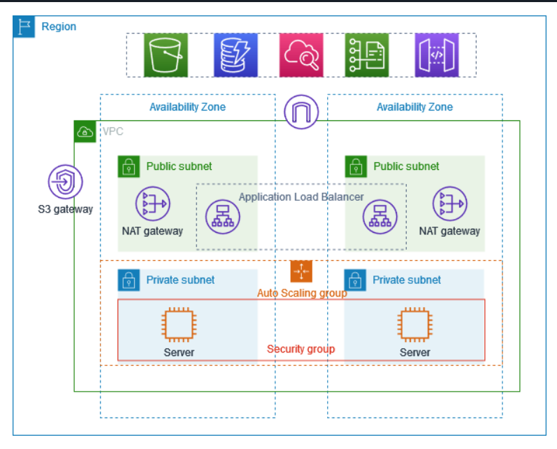
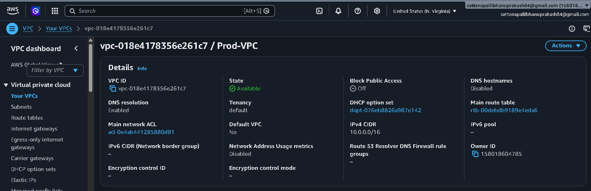
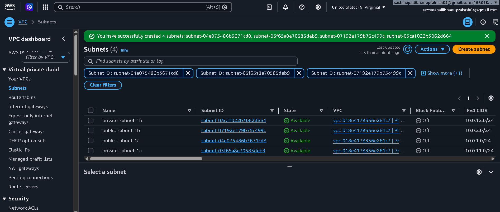
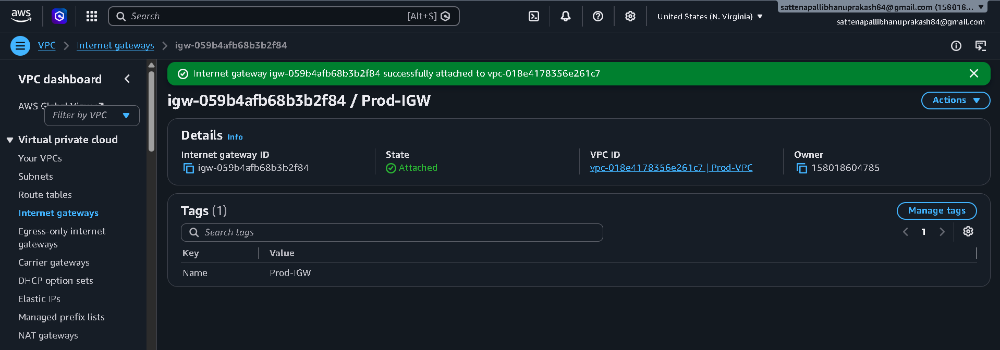
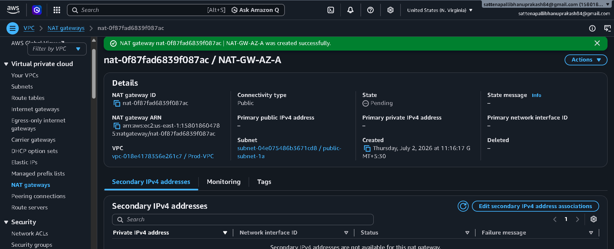
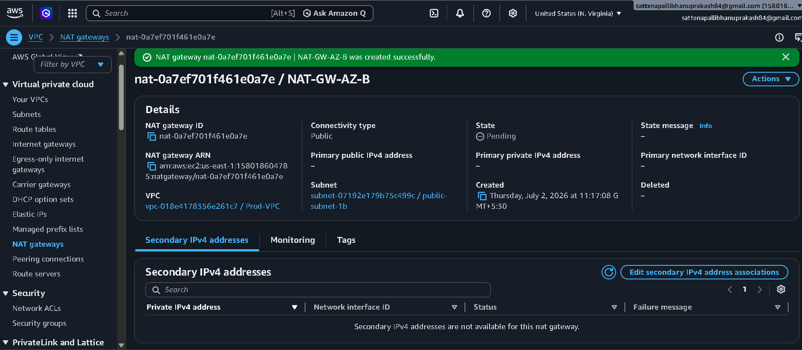

# High-Availability Multi-AZ Web Infrastructure on AWS

## Architectural Overview
I architected and deployed a highly available, fault-tolerant, and secure multi-tier web infrastructure on AWS. The core design principles of this project focus on **network isolation**, **eliminating single points of failure**, and **elastic scalability** to handle dynamic web traffic seamlessly.

---

## System Architecture Diagram

Below is the visual blueprint of the infrastructure I designed:

## System Architecture Diagram

Below is the visual blueprint of the infrastructure I designed:

---

## Infrastructure Breakdown (Step-by-Step)

### 1. Networking & Security Perimeter
* **Custom VPC Configuration:** I initiated the project by provisioning a custom Virtual Private Cloud (VPC) spanning across two separate **Availability Zones (AZs)** to guarantee high availability.
* **Subnet Isolation:** To enforce data security, I segmented each AZ into:
  * **Public Subnets:** Engineered strictly to house public-facing components and routing mechanisms.
  * **Private Subnets:** Isolated environments where the actual application servers reside, completely hidden from the public internet.
* **Secure Egress & Internal Routing:**
  * I deployed a **NAT Gateway** in each public subnet, enabling private servers to safely download patches and dependencies without exposing them to inbound threats.
  * I established an **S3 VPC Gateway Endpoint** to allow direct, private communication between the network and Amazon S3 without routing traffic through the public internet.

### 2. Traffic Management & Distribution
* **Application Load Balancer (ALB):** I deployed a public-facing ALB across the public subnets. 
* **Role:** It acts as the single point of entry for user traffic, intelligently distributing incoming HTTP/HTTPS requests across the backend instances in both AZs, ensuring efficient resource utilization and automatic failover.

### 3. Elastic Compute & Micro-Segmentation
* **Auto Scaling Group (ASG):** I configured an ASG across the private subnets to automate the lifecycle of the application servers.
  * **Scalability:** The ASG dynamically launches or terminates instances based on traffic demand, ensuring performance stability while optimizing infrastructure costs.
* **Security Groups (Stateful Firewalls):** I implemented strict firewall rules. The application servers are locked down to reject all direct internet traffic—they exclusively accept inbound traffic originating from the ALB’s designated security group.

----------------------------------------------------------------------------------------------------------------------------------------------

### 1. Production Virtual Private Cloud (VPC) Provisioning
* **Resource Configured:** `Prod-VPC`
* **VPC ID:** `vpc-018e4178356e21c7`
* **Primary IPv4 CIDR Block:** `10.0.0.0/16`

To build the foundation of this isolated infrastructure, I provisioned a dedicated, non-default Virtual Private Cloud named **Prod-VPC**. I assigned it a primary IPv4 CIDR block of **10.0.0.0/16**, yielding a theoretical maximum pool of $65,536$ private IP addresses ($2^{16}$). This massive address space provides ample room for deep network tiering, offering horizontal scalability as the underlying microservice fleets or subnets expand. 

**Key Configuration Details:**
* **DNS Settings:** I explicitly verified that **DNS Resolution** is `Enabled` to ensure resources inside the network can resolve AWS service endpoints smoothly.
* **Tenancy:** Left at `Default` to run workloads on shared, cost-effective physical hardware while maintaining logical isolation at the software layer.

----------------------------------------------------------------------------------------------------------------------------------------------

### 2. Multi-AZ Subnet Segmentation
To establish strict network boundaries and high availability, I partitioned the VPC's IP allocation into four distinct subnets distributed symmetrically across two Availability Zones (`us-east-1a` and `us-east-1b`).

* **Public Web Tier (Ingress):**
  * `public-subnet-1a` | ID: `subnet-04e075486b3671cd8` | CIDR: `10.0.1.0/24`
  * `public-subnet-1b` | ID: `subnet-07192e179b75c499c` | CIDR: `10.0.2.0/24`
* **Private Application Tier (Compute Workloads):**
  * `private-subnet-1a` | ID: `subnet-05f65a8e70585deb9` | CIDR: `10.0.11.0/24`
  * `private-subnet-1b` | ID: `subnet-03ca1022b3062d664` | CIDR: `10.0.12.0/24`

**Architectural Sizing Decisions:**
Each tier utilizes a `/24` subnet mask, allocating up to 251 usable IP addresses per subnet (accounting for AWS's 5 reserved internal IPs). This provides an optimal balance between minimizing address wastage and ensuring enough network capacity for auto-scaling events within our private runtime layer.

----------------------------------------------------------------------------------------------------------------------------------------------

### 3. Internet Gateway (IGW) Provisioning & VPC Attachment
* **Resource Configured:** `Prod-IGW`
* **Internet Gateway ID:** `igw-059b4afb68b3b2f84`
* **Status:** `Attached` to `Prod-VPC` (`vpc-018e4178356e21c7`)

To allow bi-directional internet communication for public-facing edge components (such as our Application Load Balancer), I provisioned an AWS Internet Gateway named **Prod-IGW**. I then attached it directly to our custom **Prod-VPC**. 

**Architectural Role:**
The Internet Gateway serves as a highly available, horizontally scaled, and redundant entry/exit point for our VPC network. It functions as a target in our public route tables, allowing public resources to map their public IPv4 addresses to AWS network interface cards seamlessly, while performing necessary network address translation (NAT) safely at the cloud boundary.

----------------------------------------------------------------------------------------------------------------------------------------------

### 4. Redundant NAT Gateway Provisioning (High Availability Egress)
To guarantee high availability and eliminate cross-AZ data dependency dependencies, I provisioned two separate, highly available managed NAT Gateways, distributing them symmetrically across the public ingress tiers.

* **Availability Zone A Ingress:**
  * **Resource Name:** `NAT-GW-AZ-A`
  * **ID:** `nat-0f87fad6839f087ac`
  * **Subnet Location:** `public-subnet-1a` (`subnet-04e075486b3671cd8`)
* **Availability Zone B Ingress:**
  * **Resource Name:** `NAT-GW-AZ-B`
  * **ID:** `nat-0a7ef701f461e0a7e`
  * **Subnet Location:** `public-subnet-1b` (`subnet-07192e179b75c499c`)

**Architectural Value:**
By placing a dedicated NAT Gateway in each individual Availability Zone, I ensured that outbound traffic from `private-subnet-1a` remains entirely within AZ-A, and traffic from `private-subnet-1b` remains inside AZ-B. This design isolates zone failures and completely avoids cross-AZ data transfer fees for normal internet-bound workloads.

----------------------------------------------------------------------------------------------------------------------------------------------