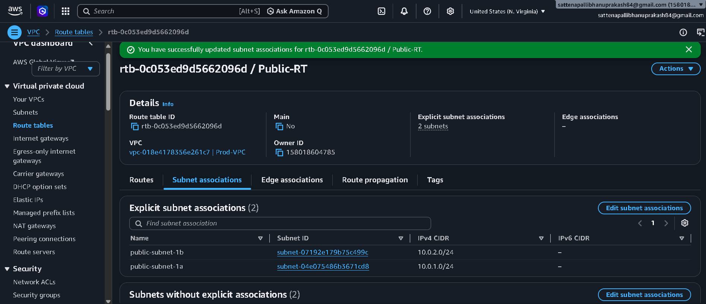
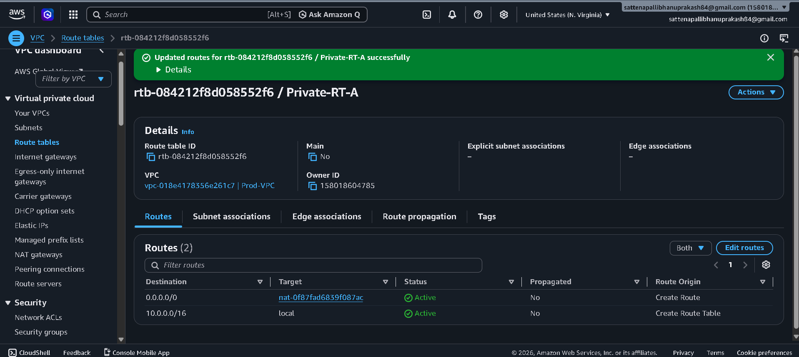
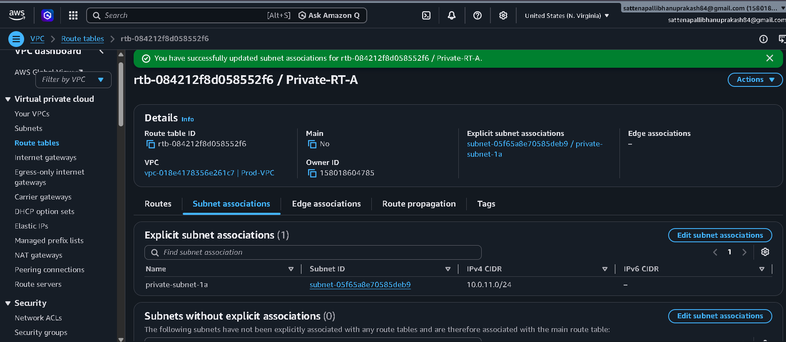
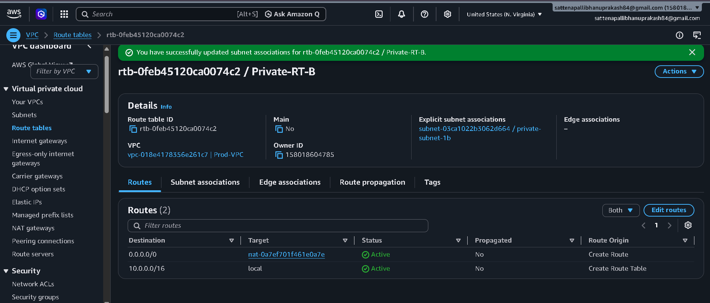
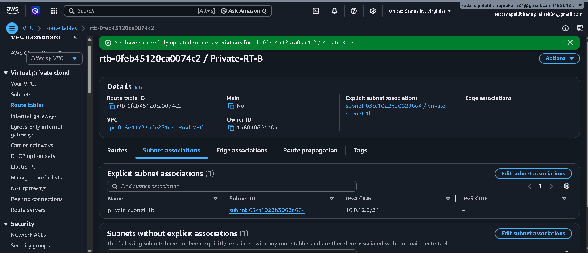
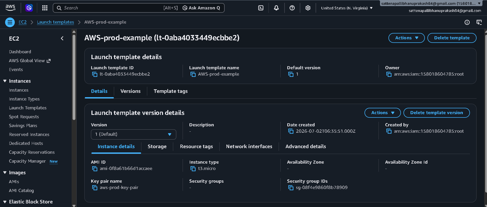
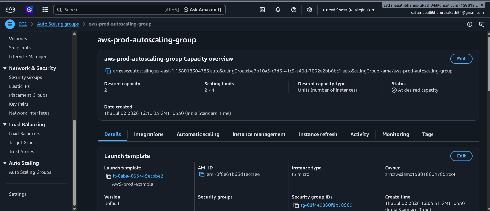
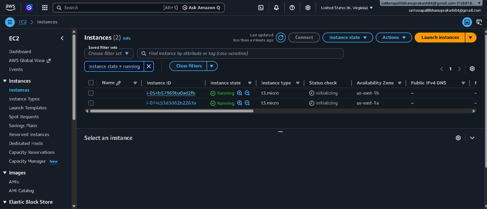

# High-Availability Multi-AZ Web Infrastructure on AWS

## Architectural Overview
I architected and deployed a highly available, fault-tolerant, and secure multi-tier web infrastructure on AWS. The core design principles of this project focus on **network isolation**, **eliminating single points of failure**, and **elastic scalability** to handle dynamic web traffic seamlessly.

---

## System Architecture Diagram

Below is the visual blueprint of the infrastructure I designed:

## System Architecture Diagram

Below is the visual blueprint of the infrastructure I designed:

---

## Infrastructure Breakdown (Step-by-Step)

### 1. Networking & Security Perimeter
* **Custom VPC Configuration:** I initiated the project by provisioning a custom Virtual Private Cloud (VPC) spanning across two separate **Availability Zones (AZs)** to guarantee high availability.
* **Subnet Isolation:** To enforce data security, I segmented each AZ into:
  * **Public Subnets:** Engineered strictly to house public-facing components and routing mechanisms.
  * **Private Subnets:** Isolated environments where the actual application servers reside, completely hidden from the public internet.
* **Secure Egress & Internal Routing:**
  * I deployed a **NAT Gateway** in each public subnet, enabling private servers to safely download patches and dependencies without exposing them to inbound threats.
  * I established an **S3 VPC Gateway Endpoint** to allow direct, private communication between the network and Amazon S3 without routing traffic through the public internet.

### 2. Traffic Management & Distribution
* **Application Load Balancer (ALB):** I deployed a public-facing ALB across the public subnets. 
* **Role:** It acts as the single point of entry for user traffic, intelligently distributing incoming HTTP/HTTPS requests across the backend instances in both AZs, ensuring efficient resource utilization and automatic failover.

### 3. Elastic Compute & Micro-Segmentation
* **Auto Scaling Group (ASG):** I configured an ASG across the private subnets to automate the lifecycle of the application servers.
  * **Scalability:** The ASG dynamically launches or terminates instances based on traffic demand, ensuring performance stability while optimizing infrastructure costs.
* **Security Groups (Stateful Firewalls):** I implemented strict firewall rules. The application servers are locked down to reject all direct internet traffic—they exclusively accept inbound traffic originating from the ALB’s designated security group.

----------------------------------------------------------------------------------------------------------------------------------------------

### 1. Production Virtual Private Cloud (VPC) Provisioning
* **Resource Configured:** `Prod-VPC`
* **VPC ID:** `vpc-018e4178356e21c7`
* **Primary IPv4 CIDR Block:** `10.0.0.0/16`

To build the foundation of this isolated infrastructure, I provisioned a dedicated, non-default Virtual Private Cloud named **Prod-VPC**. I assigned it a primary IPv4 CIDR block of **10.0.0.0/16**, yielding a theoretical maximum pool of $65,536$ private IP addresses ($2^{16}$). This massive address space provides ample room for deep network tiering, offering horizontal scalability as the underlying microservice fleets or subnets expand. 

**Key Configuration Details:**
* **DNS Settings:** I explicitly verified that **DNS Resolution** is `Enabled` to ensure resources inside the network can resolve AWS service endpoints smoothly.
* **Tenancy:** Left at `Default` to run workloads on shared, cost-effective physical hardware while maintaining logical isolation at the software layer.

----------------------------------------------------------------------------------------------------------------------------------------------

### 2. Multi-AZ Subnet Segmentation
To establish strict network boundaries and high availability, I partitioned the VPC's IP allocation into four distinct subnets distributed symmetrically across two Availability Zones (`us-east-1a` and `us-east-1b`).

* **Public Web Tier (Ingress):**
  * `public-subnet-1a` | ID: `subnet-04e075486b3671cd8` | CIDR: `10.0.1.0/24`
  * `public-subnet-1b` | ID: `subnet-07192e179b75c499c` | CIDR: `10.0.2.0/24`
* **Private Application Tier (Compute Workloads):**
  * `private-subnet-1a` | ID: `subnet-05f65a8e70585deb9` | CIDR: `10.0.11.0/24`
  * `private-subnet-1b` | ID: `subnet-03ca1022b3062d664` | CIDR: `10.0.12.0/24`

**Architectural Sizing Decisions:**
Each tier utilizes a `/24` subnet mask, allocating up to 251 usable IP addresses per subnet (accounting for AWS's 5 reserved internal IPs). This provides an optimal balance between minimizing address wastage and ensuring enough network capacity for auto-scaling events within our private runtime layer.

----------------------------------------------------------------------------------------------------------------------------------------------

### 3. Internet Gateway (IGW) Provisioning & VPC Attachment
* **Resource Configured:** `Prod-IGW`
* **Internet Gateway ID:** `igw-059b4afb68b3b2f84`
* **Status:** `Attached` to `Prod-VPC` (`vpc-018e4178356e21c7`)

To allow bi-directional internet communication for public-facing edge components (such as our Application Load Balancer), I provisioned an AWS Internet Gateway named **Prod-IGW**. I then attached it directly to our custom **Prod-VPC**. 

**Architectural Role:**
The Internet Gateway serves as a highly available, horizontally scaled, and redundant entry/exit point for our VPC network. It functions as a target in our public route tables, allowing public resources to map their public IPv4 addresses to AWS network interface cards seamlessly, while performing necessary network address translation (NAT) safely at the cloud boundary.

----------------------------------------------------------------------------------------------------------------------------------------------

### 4. Redundant NAT Gateway Provisioning (High Availability Egress)
To guarantee high availability and eliminate cross-AZ data dependency dependencies, I provisioned two separate, highly available managed NAT Gateways, distributing them symmetrically across the public ingress tiers.

* **Availability Zone A Ingress:**
  * **Resource Name:** `NAT-GW-AZ-A`
  * **ID:** `nat-0f87fad6839f087ac`
  * **Subnet Location:** `public-subnet-1a` (`subnet-04e075486b3671cd8`)
* **Availability Zone B Ingress:**
  * **Resource Name:** `NAT-GW-AZ-B`
  * **ID:** `nat-0a7ef701f461e0a7e`
  * **Subnet Location:** `public-subnet-1b` (`subnet-07192e179b75c499c`)

**Architectural Value:**
By placing a dedicated NAT Gateway in each individual Availability Zone, I ensured that outbound traffic from `private-subnet-1a` remains entirely within AZ-A, and traffic from `private-subnet-1b` remains inside AZ-B. This design isolates zone failures and completely avoids cross-AZ data transfer fees for normal internet-bound workloads.

----------------------------------------------------------------------------------------------------------------------------------------------

### 5. Advanced Custom Route Table Implementation & Subnet Associations
To orchestrate and enforce strict deterministic traffic policies across the public and private layers, I established a custom three-tier routing matrix. This completely segregates ingress and egress data streams.

#### Architectural Rationale & Design Philosophy
The separation of subnets into distinct public and private route tables is driven by the core cloud security principle of **Network Segmentation and Least Privilege Access**:

* **Why Public Subnets and the Internet Gateway (IGW) share a Route Table:** The Public Route Table acts as our edge transit layer. An IGW is a bi-directional gateway; it allows resources with public IPs to be reached from the outside internet and vice-versa. By mapping only the public subnets to the IGW via `0.0.0.0/0`, we create a designated demilitarized zone (DMZ). Only public-facing infrastructure (like our Application Load Balancer) resides here to intercept, inspect, and filter incoming traffic.
  
* **Why Private Subnets map strictly to NAT Gateways in Private Route Tables:** Our core application business logic and servers are highly sensitive and should never accept uninitiated inbound connections from the public internet. However, these servers still require *outbound-only* access to download security patches, fetch third-party API payloads, or pull container images. 
  
  By mapping the private subnets to a **NAT Gateway**, we achieve asymmetric network isolation. A NAT Gateway operates as a one-way proxy: it translates the private IP addresses of our compute instances into a single public Elastic IP to send requests out, but securely discards any unsolicited inbound traffic trying to sneak backward through that same path. Decoupling this into independent route tables per zone (`Private-RT-A` and `Private-RT-B`) ensures that a failure or configuration error in one zone's egress path cannot ripple across and cause a complete cascading cluster failure.

---

#### A. Edge Ingress Layer (`Public-RT`)
* **Route Table ID:** `rtb-0c053ed9d5662096d`
* **Network Target:** Attached directly to the Internet Gateway (`Prod-IGW` | `igw-059b4afb68b3b2f84`) via a default route destination (`0.0.0.0/0`).
* **Explicit Subnet Associations:** Explicitly mapped to `public-subnet-1a` and `public-subnet-1b`.

#### B. Isolated Egress Compute Layer - Zone A (`Private-RT-A`)
* **Route Table ID:** `rtb-084212f8d058552f6`
* **Network Target:** Routes all outbound internet requests (`0.0.0.0/0`) locally through `NAT-GW-AZ-A` (`nat-0f87fad6839f087ac`).
* **Explicit Subnet Association:** Mapped strictly to `private-subnet-1a`.

#### C. Isolated Egress Compute Layer - Zone B (`Private-RT-B`)
* **Route Table ID:** `rtb-0feb45120ca0074c2`
* **Network Target:** Routes all outbound internet requests (`0.0.0.0/0`) locally through `NAT-GW-AZ-B` (`nat-0a7ef701f461e0a7e`).
* **Explicit Subnet Association:** Mapped strictly to `private-subnet-1b`.

**Architectural Value Added:**
This configuration ensures that both compute zones remain strictly isolated from direct inbound connection attempts. By decoupling the private routing targets, the infrastructure remains fully operational and fault-isolated—if one NAT Gateway suffers an outage, the secondary availability zone's routing topology remains completely unaffected.

----------------------------------------------------------------------------------------------------------------------------------------------

### 7. Automated Compute Fleets via Launch Templates & Auto Scaling Groups
To achieve true system elasticity and ensure our web application tier is highly available and resilient against instance degradation, I implemented an automated compute management lifecycle strategy.

#### A. Standardized Server Blueprint (`Launch Template`)
* **Template Name:** `AWS-prod-example`
* **Template ID:** `lt-0aba4033449ecbbe2`
* **Configuration Parameters:**
  * **Instance Type:** `t3.micro` (Balancing burstable performance requirements with optimized compute costs).
  * **Amazon Machine Image (AMI):** `ami-0f8a61b66d1accaee`
  * **Key Pair:** `aws-prod-key-pair` (Assigned for secure cryptographic SSH administrative access).
  * **Security Group Associated:** `sg-08f4e9860f8b78909`

#### B. Dynamic Fleet Orchestration (`Auto Scaling Group`)
* **ASG Name:** `aws-prod-autoscaling-group`
* **Status:** `At desired capacity` (Fleet successfully initialized).
* **Capacity Sizing Dimensions:**
  * **Desired Capacity:** 2 Instances
  * **Minimum Boundary:** 2 Instances
  * **Maximum Scaling Boundary:** 4 Instances

#### C. Operational Compute Runtime Runtime Layer
* **Instance Fleet Active Deployment Count:** 2 Running Instances
* **Fault-Tolerant Distribution Verification:**
  * `i-074c53d3d62b2263a` -> Successfully deployed into Availability Zone **`us-east-1a`**.
  * `i-054b5796ba0ad2fb` -> Successfully deployed into Availability Zone **`us-east-1b`**.
* **Public IPv4 DNS Status:** Completely `Disabled` (Confirming successful structural isolation within the private subnets).

---

### 🧠 Architectural Verification & Design Patterns Met
1. **Immutable Infrastructure Blueprint:** By leveraging an EC2 Launch Template instead of manually spinning up virtual machines, I ensured that every new instance introduced to the cluster is configuration-identical. This eliminates configuration drift across environments.
2. **Symmetric High Availability (HA):** As captured in the runtime screenshot, the Auto Scaling Group successfully split the workload perfectly across two independent data centers (`us-east-1a` and `us-east-1b`). If an entire availability zone encounters a physical hardware failure, the ASG will instantly recognize the loss of heartbeats and dynamically spin up replacement instances in the surviving zone to maintain the desired threshold.
3. **True Network Isolation:** The instance fleet dashboard confirms that these compute servers have no public IP addresses or public DNS endpoints assigned. They are fully secured behind our private subnet tier, relying strictly on our NAT Gateways for egress patch management and looking ahead to receive user traffic solely via the Application Load Balancer.

----------------------------------------------------------------------------------------------------------------------------------------------