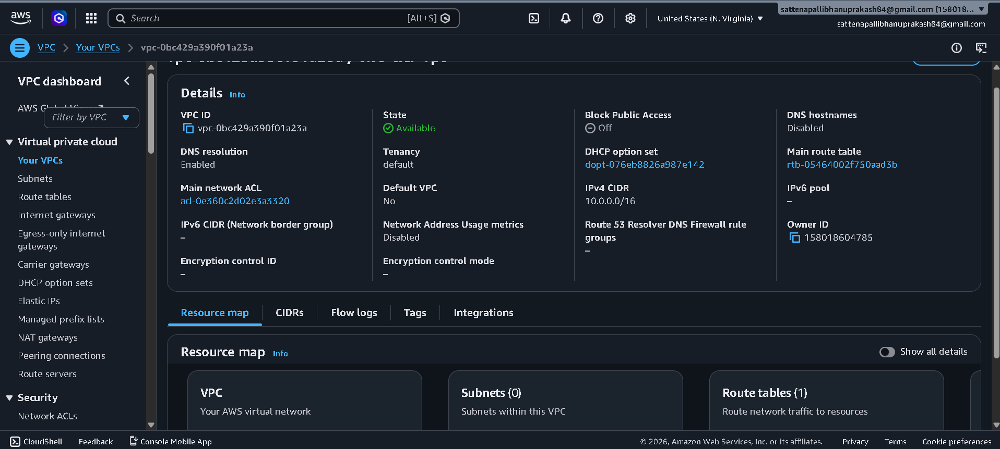
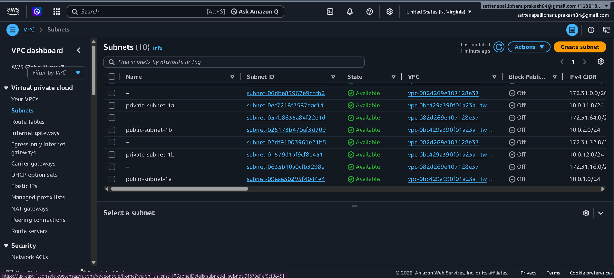
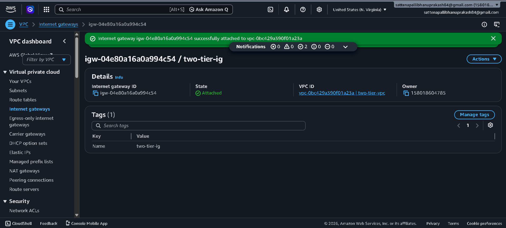

# Production-Ready High Availability Two-Tier AWS Architecture

## 🏗️ Architecture Design & Components

The complete enterprise infrastructure topology is documented visually in the `architecture.png` file below. This setup demonstrates a fault-tolerant, secure web application framework distributed across multiple Availability Zones (AZs).

---

## 💻 Tier 1: Web & Application Layer

### 🌐 Public-Facing Routing & Compute
This layer handles initial user ingress and balances incoming traffic across scalable, self-healing application nodes.
*   **Application Load Balancer (ALB):** Positioned within the public subnets to serve as the single entry point for external client traffic. It automatically distributes incoming **HTTP (Port 80)** and **HTTPS (Port 443)** traffic across active compute nodes.
*   **Auto Scaling Group (ASG):** Orchestrates high availability by dynamically managing EC2 instance counts across **Availability Zone 1 (AZ-1)** and **Availability Zone 2 (AZ-2)** to seamlessly absorb traffic spikes or compute failures.
*   **Web Security Group (Web SG):** Acts as a virtual firewall for the application layer, strictly configured to **Allow only HTTP/S (80/443)** inbound traffic from the public internet.

---

## 🗄️ Tier 2: Database Layer

### 🔒 Private Data Segregation
This layer isolates critical backend storage from direct internet exposure while providing automated failover mechanisms.
*   **Isolated Private Subnets:** All database assets are intentionally deployed within isolated private subnets, ensuring zero public IP assignments and eliminating direct ingress paths from the internet.
*   **Amazon RDS Multi-AZ Deployment:** Configured with an active **RDS Primary (Master) Instance** in **AZ-1** that continuously runs **Synchronous Replication** to an **RDS Standby (Replica) Instance** in **AZ-2**. This provides high-availability disaster recovery with automatic **DNS Failover**.
*   **Database Security Group (DB SG):** Enforces a strict network perimeter by utilizing rule-chaining to **Allow only DB port traffic** originating explicitly from the **Web SG** tier.

---

## 🛡️ Applied Security Boundaries

### ⚡ Principle of Least Privilege
*   **Network Segregation:** Traffic cannot bypass the Application Load Balancer to hit the EC2 instances directly, and the database tier completely rejects any communication not initiated by the application nodes.
*   **Structural Redundancy:** By splitting resources across distinct geographical Availability Zones, the architecture guarantees minimal downtime and eliminates single points of failure (SPOFs).
--------------------------------------------------------------------------------------------------------------------------------------------

## 🌐 Phase 1: Networking & Security Infrastructure

### 🗺️ Virtual Private Cloud (VPC) Initialization
The foundational network layer was established by provisioning a custom Virtual Private Cloud (VPC) named `two-tier-vpc`. This isolated network boundary hosts the entire compute and database fleet.

#### ⚙️ Core VPC Configurations:
* **VPC ID:** `vpc-0bc429a390f01a23a`
* **IPv4 CIDR Block:** `10.0.0.0/16` (Provides `65,536` available private IP addresses for scalable subnetting)
* **DNS Settings:** `DNS resolution` has been explicitly **Enabled** to ensure internal AWS service endpoints can resolve seamlessly.
* **Tenancy:** Configured as **Default** to run on shared hardware, optimizing cost efficiency.

----------------------------------------------------------------------------------------------------------------------------------------------

### 🗺️ Subnet Segmentation & IP Strategy

To enforce tight network isolation, the `two-tier-vpc` was segmented into four distinct subnets across multiple Availability Zones. This layout physically isolates public-facing web routing from private data storage nodes.

#### 📊 Subnet Configuration Directory

| Subnet Name | Subnet ID | Availability Zone | IPv4 CIDR Block | Auto-Assign Public IPv4 | Role / Layer |
| :--- | :--- | :--- | :--- | :--- | :--- |
| **public-subnet-1a** | `subnet-09eae50295f40d4e4` | `us-east-1a` | `10.0.1.0/24` | **Enabled** | Presentation (ALB / Ingress) |
| **public-subnet-1b** | `subnet-025173b470af3d709` | `us-east-1b` | `10.0.2.0/24` | **Enabled** | Presentation (ALB / Ingress) |
| **private-subnet-1a** | `subnet-0ec7218f7587dac14` | `us-east-1a` | `10.0.11.0/24` | **Disabled** | Persistent Data (Amazon RDS) |
| **private-subnet-1b** | `subnet-01579d1af9cf8e451` | `us-east-1b` | `10.0.12.0/24` | **Disabled** | Persistent Data (Amazon RDS) |

#### ⚙️ Engineering Implementation Details:
* **Public Subnets (`10.0.1.0/24` & `10.0.2.0/24`):** Configured with `MapPublicIpOnLaunch` set to **True** (Enable auto-assign public IP address). This allows the Application Load Balancer endpoints to obtain valid public IPv4 addresses for internet-facing routing.
* **Private Subnets (`10.0.11.0/24` & `10.0.12.0/24`):** Kept with `MapPublicIpOnLaunch` set to **False** (Disable auto-assign public IP address). This creates a strict security boundary by ensuring that no resources provisioned within this database layer are reachable or viewable from external networks.

----------------------------------------------------------------------------------------------------------------------------------------------

### 🌐 Edge Routing: Internet Gateway Provisioning

An Internet Gateway (IGW) was created and attached to the virtual network edge to facilitate bi-directional internet routing for public-facing assets (such as the Application Load Balancer).

#### ⚙️ Gateway Implementation details:
* **Internet Gateway Name:** `two-tier-ig`
* **Internet Gateway ID:** `igw-04e80a16a0a994c54`
* **Operational State:** **Attached**
* **Target VPC Link:** `vpc-0bc429a390f01a23a | two-tier-vpc`

#### 📝 Implementation Notes:
The gateway acts as the critical edge device enabling external public HTTP/S traffic to cross the boundary into our configured public subnets. Resources within the private subnets remain shielded from this gateway via isolated route tables, maintaining zero inbound path exposure from the public web.

---------------------------------------------------------------------------------------------------------------------------------------------

### 🛣️ Public Routing Matrix & Subnet Associations

A custom public route table named `public-rt` was provisioned to direct inbound and outbound web traffic between the internet and the presentation tier.

#### ⚙️ Route Table Overview:
* **Route Table ID:** `rtb-0f3094922c883037`
* **Target VPC Link:** `vpc-0bc429a390f01a23a | two-tier-vpc`

---

### 🗺️ 1. Network Routing Entry Rules
To enable active communication with external clients, a default static route pointing to the Internet Gateway was appended to the local VPC target rules.

| Destination | Target | Status | Propagated | Description |
| :--- | :--- | :--- | :--- | :--- |
| `10.0.0.0/16` | `local` | **Active** | No | Internal VPC routing for all subnets |
| `0.0.0.0/0` | `igw-04e80a16a0a994c54` | **Active** | No | Default gateway route out to the public Internet via `two-tier-ig` |

---

### 🔗 2. Explicit Subnet Associations
The two public subnets mapped out in the IP planning phase were explicitly bound to this route table, effectively granting them public-facing functionality.

* **Associated Subnet 1:** `public-subnet-1a` (`subnet-09eae50295f40d4e4`) — **CIDR:** `10.0.1.0/24`
* **Associated Subnet 2:** `public-subnet-1b` (`subnet-025173b470af3d709`) — **CIDR:** `10.0.2.0/24`

> 💡 **Architectural Isolation Note:** Because only the public subnets are associated here, our private database subnets remain entirely detached from this table. With no route targeting `0.0.0.0/0` via an Internet Gateway, the database tier is locked down securely against inbound threats from the public internet.