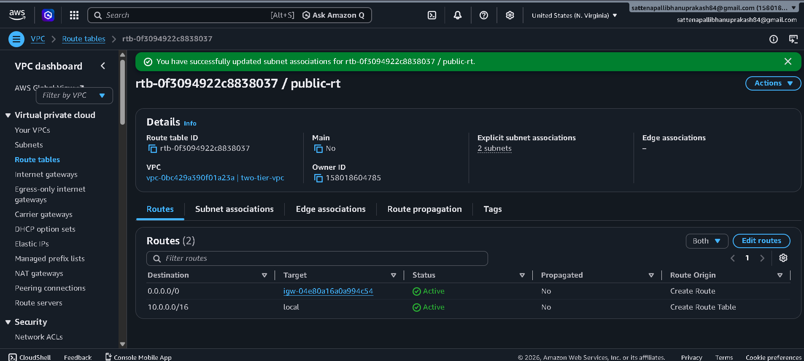
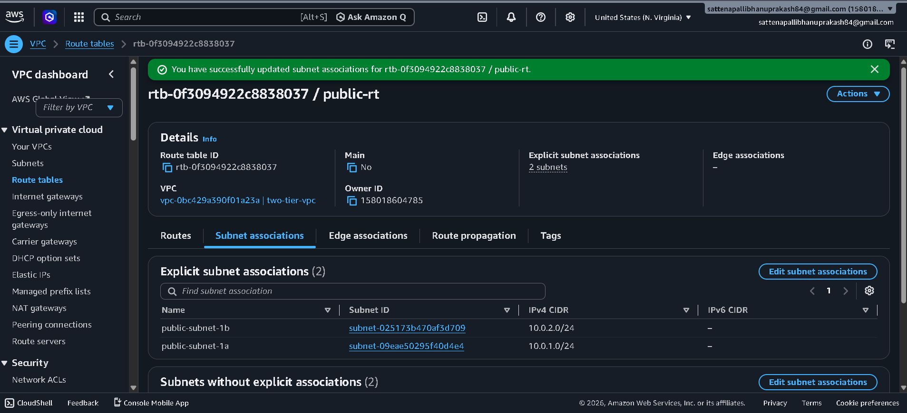
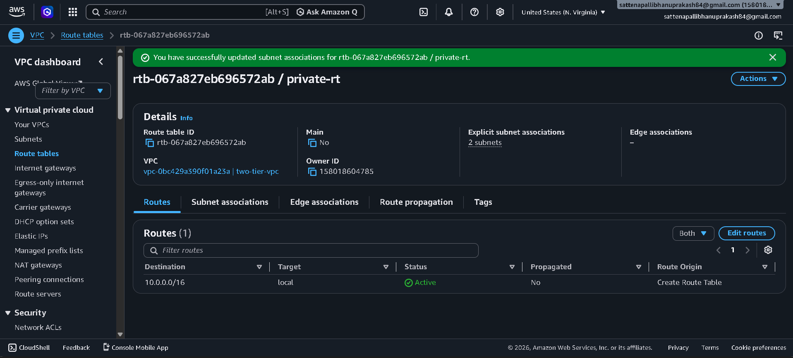
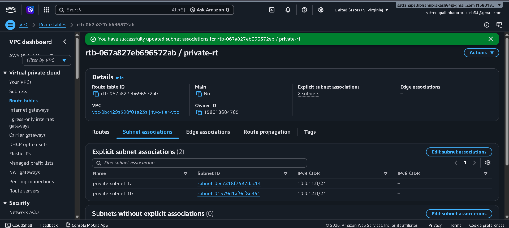
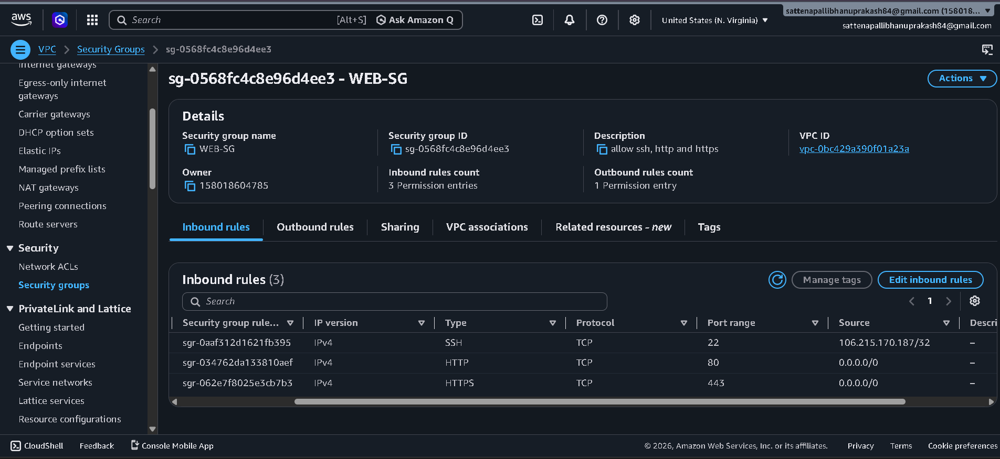
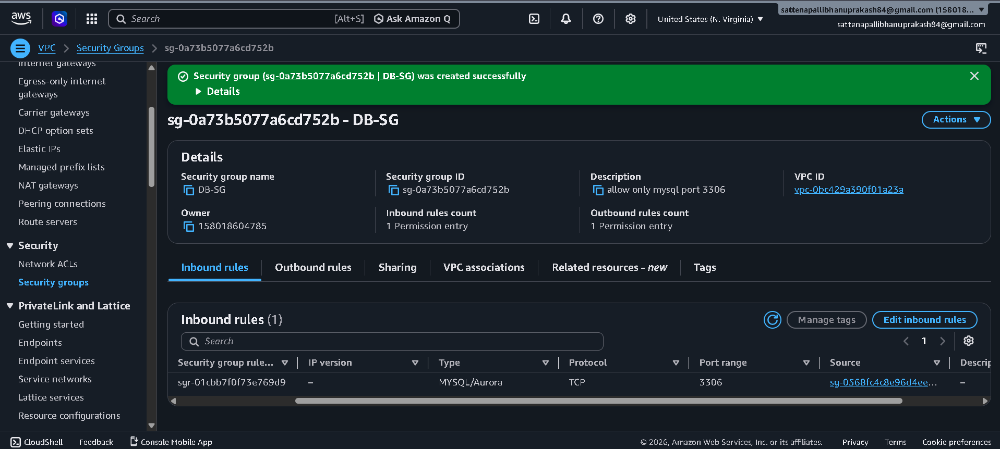
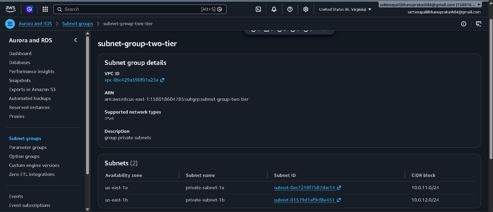
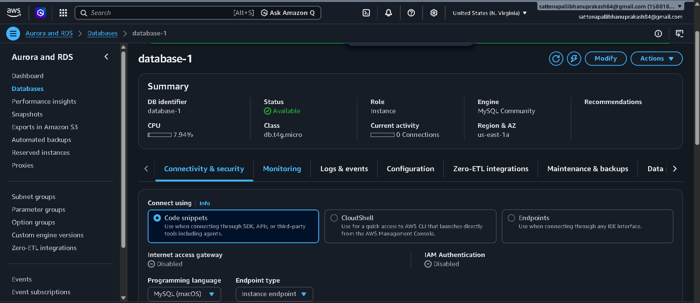

# Production-Ready High Availability Two-Tier AWS Architecture

## 🏗️ Architecture Design & Components

The complete enterprise infrastructure topology is documented visually in the `architecture.png` file below. This setup demonstrates a fault-tolerant, secure web application framework distributed across multiple Availability Zones (AZs).

---

## 💻 Tier 1: Web & Application Layer

### 🌐 Public-Facing Routing & Compute
This layer handles initial user ingress and balances incoming traffic across scalable, self-healing application nodes.
*   **Application Load Balancer (ALB):** Positioned within the public subnets to serve as the single entry point for external client traffic. It automatically distributes incoming **HTTP (Port 80)** and **HTTPS (Port 443)** traffic across active compute nodes.
*   **Auto Scaling Group (ASG):** Orchestrates high availability by dynamically managing EC2 instance counts across **Availability Zone 1 (AZ-1)** and **Availability Zone 2 (AZ-2)** to seamlessly absorb traffic spikes or compute failures.
*   **Web Security Group (Web SG):** Acts as a virtual firewall for the application layer, strictly configured to **Allow only HTTP/S (80/443)** inbound traffic from the public internet.

---

## 🗄️ Tier 2: Database Layer

### 🔒 Private Data Segregation
This layer isolates critical backend storage from direct internet exposure while providing automated failover mechanisms.
*   **Isolated Private Subnets:** All database assets are intentionally deployed within isolated private subnets, ensuring zero public IP assignments and eliminating direct ingress paths from the internet.
*   **Amazon RDS Multi-AZ Deployment:** Configured with an active **RDS Primary (Master) Instance** in **AZ-1** that continuously runs **Synchronous Replication** to an **RDS Standby (Replica) Instance** in **AZ-2**. This provides high-availability disaster recovery with automatic **DNS Failover**.
*   **Database Security Group (DB SG):** Enforces a strict network perimeter by utilizing rule-chaining to **Allow only DB port traffic** originating explicitly from the **Web SG** tier.

---

## 🛡️ Applied Security Boundaries

### ⚡ Principle of Least Privilege
*   **Network Segregation:** Traffic cannot bypass the Application Load Balancer to hit the EC2 instances directly, and the database tier completely rejects any communication not initiated by the application nodes.
*   **Structural Redundancy:** By splitting resources across distinct geographical Availability Zones, the architecture guarantees minimal downtime and eliminates single points of failure (SPOFs).
--------------------------------------------------------------------------------------------------------------------------------------------

## 🌐 Phase 1: Networking & Security Infrastructure

### 🗺️ Virtual Private Cloud (VPC) Initialization
The foundational network layer was established by provisioning a custom Virtual Private Cloud (VPC) named `two-tier-vpc`. This isolated network boundary hosts the entire compute and database fleet.

#### ⚙️ Core VPC Configurations:
* **VPC ID:** `vpc-0bc429a390f01a23a`
* **IPv4 CIDR Block:** `10.0.0.0/16` (Provides `65,536` available private IP addresses for scalable subnetting)
* **DNS Settings:** `DNS resolution` has been explicitly **Enabled** to ensure internal AWS service endpoints can resolve seamlessly.
* **Tenancy:** Configured as **Default** to run on shared hardware, optimizing cost efficiency.

----------------------------------------------------------------------------------------------------------------------------------------------

### 🗺️ Subnet Segmentation & IP Strategy

To enforce tight network isolation, the `two-tier-vpc` was segmented into four distinct subnets across multiple Availability Zones. This layout physically isolates public-facing web routing from private data storage nodes.

#### 📊 Subnet Configuration Directory

| Subnet Name | Subnet ID | Availability Zone | IPv4 CIDR Block | Auto-Assign Public IPv4 | Role / Layer |
| :--- | :--- | :--- | :--- | :--- | :--- |
| **public-subnet-1a** | `subnet-09eae50295f40d4e4` | `us-east-1a` | `10.0.1.0/24` | **Enabled** | Presentation (ALB / Ingress) |
| **public-subnet-1b** | `subnet-025173b470af3d709` | `us-east-1b` | `10.0.2.0/24` | **Enabled** | Presentation (ALB / Ingress) |
| **private-subnet-1a** | `subnet-0ec7218f7587dac14` | `us-east-1a` | `10.0.11.0/24` | **Disabled** | Persistent Data (Amazon RDS) |
| **private-subnet-1b** | `subnet-01579d1af9cf8e451` | `us-east-1b` | `10.0.12.0/24` | **Disabled** | Persistent Data (Amazon RDS) |

#### ⚙️ Engineering Implementation Details:
* **Public Subnets (`10.0.1.0/24` & `10.0.2.0/24`):** Configured with `MapPublicIpOnLaunch` set to **True** (Enable auto-assign public IP address). This allows the Application Load Balancer endpoints to obtain valid public IPv4 addresses for internet-facing routing.
* **Private Subnets (`10.0.11.0/24` & `10.0.12.0/24`):** Kept with `MapPublicIpOnLaunch` set to **False** (Disable auto-assign public IP address). This creates a strict security boundary by ensuring that no resources provisioned within this database layer are reachable or viewable from external networks.

----------------------------------------------------------------------------------------------------------------------------------------------

### 🌐 Edge Routing: Internet Gateway Provisioning

An Internet Gateway (IGW) was created and attached to the virtual network edge to facilitate bi-directional internet routing for public-facing assets (such as the Application Load Balancer).

#### ⚙️ Gateway Implementation details:
* **Internet Gateway Name:** `two-tier-ig`
* **Internet Gateway ID:** `igw-04e80a16a0a994c54`
* **Operational State:** **Attached**
* **Target VPC Link:** `vpc-0bc429a390f01a23a | two-tier-vpc`

#### 📝 Implementation Notes:
The gateway acts as the critical edge device enabling external public HTTP/S traffic to cross the boundary into our configured public subnets. Resources within the private subnets remain shielded from this gateway via isolated route tables, maintaining zero inbound path exposure from the public web.

---------------------------------------------------------------------------------------------------------------------------------------------

### 🛣️ Public Routing Matrix & Subnet Associations

A custom public route table named `public-rt` was provisioned to direct inbound and outbound web traffic between the internet and the presentation tier.

#### ⚙️ Route Table Overview:
* **Route Table ID:** `rtb-0f3094922c883037`
* **Target VPC Link:** `vpc-0bc429a390f01a23a | two-tier-vpc`

---

### 🗺️ 1. Network Routing Entry Rules
To enable active communication with external clients, a default static route pointing to the Internet Gateway was appended to the local VPC target rules.

| Destination | Target | Status | Propagated | Description |
| :--- | :--- | :--- | :--- | :--- |
| `10.0.0.0/16` | `local` | **Active** | No | Internal VPC routing for all subnets |
| `0.0.0.0/0` | `igw-04e80a16a0a994c54` | **Active** | No | Default gateway route out to the public Internet via `two-tier-ig` |

---

### 🔗 2. Explicit Subnet Associations
The two public subnets mapped out in the IP planning phase were explicitly bound to this route table, effectively granting them public-facing functionality.

* **Associated Subnet 1:** `public-subnet-1a` (`subnet-09eae50295f40d4e4`) — **CIDR:** `10.0.1.0/24`
* **Associated Subnet 2:** `public-subnet-1b` (`subnet-025173b470af3d709`) — **CIDR:** `10.0.2.0/24`

> 💡 **Architectural Isolation Note:** Because only the public subnets are associated here, our private database subnets remain entirely detached from this table. With no route targeting `0.0.0.0/0` via an Internet Gateway, the database tier is locked down securely against inbound threats from the public internet.

### 🔏 Private Routing Matrix & Network Isolation

To finalize the networking topology, a dedicated private route table named `private-rt` was provisioned. This table enforces absolute isolation for the backend database assets by intentionally omitting an outbound edge route to the Internet Gateway.

#### ⚙️ Route Table Overview:
* **Route Table ID:** `rtb-067a827eb696572ab`
* **Target VPC Link:** `vpc-0bc429a390f01a23a | two-tier-vpc`

---

### 🗺️ 1. Isolated Network Routing Entry Rules
The routing engine contains exclusively a local communication block, preventing any resources inside the attached subnets from routing out to or receiving connections from the public web.

| Destination | Target | Status | Propagated | Description |
| :--- | :--- | :--- | :--- | :--- |
| `10.0.0.0/16` | `local` | **Active** | No | Internal VPC routing limited strictly to internal subnets |

---

### 🔗 2. Private Subnet Associations
The two database subnets were explicitly bound to this private route table to guarantee that their compute or data assets can never be exposed to external network elements.

* **Associated Subnet 1:** `private-subnet-1a` (`subnet-0ec7218f7587dac14`) — **CIDR:** `10.0.11.0/24`
* **Associated Subnet 2:** `private-subnet-1b` (`subnet-01579d1af9cf8e451`) — **CIDR:** `10.0.12.0/24`

> 🔒 **Architectural Security Verification:** Because there is **no route to 0.0.0.0/0 via an Internet Gateway (`igw-xxxx`)** or public edge interface, this database layer is 100% air-gapped from direct external vectors. Communication to this tier is only possible internally from authorized resources within the VPC boundary (via the Web SG layer).

---------------------------------------------------------------------------------------------------------------------------------------------

### 🛡️ State-Level Firewalling: Web Security Group Configuration

To regulate ingress and egress boundaries for the application tier, a custom stateful firewall rule set named `WEB-SG` was established. This ensures public web traffic can interact with our frontend interfaces while securing administrative access protocols.

#### ⚙️ Security Group Overview:
* **Security Group Name:** `WEB-SG`
* **Security Group ID:** `sg-0568fc4c8e96d4ee3`
* **Target VPC Link:** `vpc-0bc429a390f01a23a`

---

### 📥 Inbound Traffic Control Policies (Ingress)
The security perimeter was hardened by allowing web traffic from any destination while completely locking down administrative access to a single authoritative operator workstation.

| Rule ID | Protocol | Port Range | Source | Traffic Type / Description |
| :--- | :--- | :--- | :--- | :--- |
| `sgr-034762da133810aef` | `TCP` | `80` | `0.0.0.0/0` | **HTTP:** Web ingress allowed from anywhere on IPv4 |
| `sgr-062e7f8025e3cb7b3` | `TCP` | `443` | `0.0.0.0/0` | **HTTPS:** Secure web ingress allowed from anywhere on IPv4 |
| `sgr-0aaf312d1621fb395` | `TCP` | `22` | `106.215.170.187/32` | **SSH:** Restricted administrative access mapping strictly to the administrator's explicit public IP |

---

### 📤 Outbound Traffic Control Policies (Egress)
* **Outbound Rule Count:** `1 Permission entry`
* **Configuration Policy:** The outbound rules layer is maintained at the default **All Traffic (`0.0.0.0/0`)** baseline. This allows active compute nodes to communicate freely with internal AWS endpoints, retrieve external library dependencies, and perform package tracking updates securely.
---------------------------------------------------------------------------------------------------------------------------------------------

### 🛡️ Isolation Layer: Database Security Group Configuration

To strictly control ingress communication targeting the database cluster, a custom security group named `DB-SG` was implemented. This layer blocks all public exposure by utilizing stateful security group nesting/chaining policies.

#### ⚙️ Security Group Overview:
* **Security Group Name:** `DB-SG`
* **Security Group ID:** `sg-0a73b5077a6cd752b`
* **Target VPC Link:** `vpc-0bc429a390f01a23a`
* **Functional Description:** `allow only mysql port 3306`

---

### 📥 Inbound Traffic Control Policies (Ingress Security Chaining)
The network rule defines zero public access. The data tier completely rejects any direct internet traffic and permits transactions exclusively from compute nodes running within the presentation tier.

| Rule ID | Type / Protocol | Port Range | Source Target | Strategic Implementation |
| :--- | :--- | :--- | :--- | :--- |
| `sgr-01cbb7f0f73e769d9` | `MYSQL/Aurora (TCP)` | `3306` | `sg-0568fc4c8e96d4ee3` | **Security Group Chaining:** Grants ingress database traffic permissions *only* to resources actively running within the `WEB-SG` fleet. |

---

### 📤 Outbound Traffic Control Policies (Egress)
* **Outbound Rule Count:** `1 Permission entry`
* **Configuration Policy:** Maintained at the default **All Traffic (`0.0.0.0/0`)** baseline. Because the database subnets lack a routing target out to an Internet Gateway (`igw`), this outbound rule remains completely contained inside the internal local network boundary.

---------------------------------------------------------------------------------------------------------------------------------------------

---

## 🗄️ Phase 2: High Availability Database Provisioning

### 📁 DB Subnet Group Implementation
To support a Multi-AZ Amazon RDS container layout, a dedicated database subnet group named `subnet-group-two-tier` was created. This group maps logical private subnet boundaries together, giving the RDS engine the infrastructure baseline required to distribute primary and standby storage nodes seamlessly across independent geographic zones.

#### ⚙️ Subnet Group Technical Details:
* **Subnet Group Name:** `subnet-group-two-tier`
* **Description:** `group private subnets`
* **VPC Association ID:** `vpc-0bc429a390f01a23a`
* **ARN:** `arn:aws:rds:us-east-1:158018604785:subgrp:subnet-group-two-tier`
* **Supported Network Types:** IPv4

---

### 🗺️ Bound Infrastructure Topology
The group bundles our explicitly isolated private subnets across target Availability Zones to fulfill high availability disaster recovery prerequisites.

| Availability Zone | Subnet Name | Subnet Resource ID | Assigned CIDR Block | Role Mapping |
| :--- | :--- | :--- | :--- | :--- |
| **us-east-1a** | `private-subnet-1a` | `subnet-0ec7218f7587dac14` | `10.0.11.0/24` | Active Primary Node Hosting Space |
| **us-east-1b** | `private-subnet-1b` | `subnet-01579d1af9cf8e451` | `10.0.12.0/24` | Passive Standby Failover Space |

> 💡 **Architectural Best Practice Check:** By grouping exclusively private subnets with no direct internet pathways, we establish a robust perimeter layer. Amazon RDS uses this group configuration to guarantee your backend database instances are never accidentally provisioned inside an internet-facing public subnet.

----------------------------------------------------------------------------------------------------------------------------------------------

### 🗄️ Amazon RDS Instance Provisioning

The database engine was successfully provisioned using Amazon Relational Database Service (RDS), creating an isolated, production-ready relational data layer.

#### ⚙️ Database Engine & Instance Core Metrics:
* **DB Identifier:** `database-1`
* **Database Engine:** `MySQL Community` (Open-source relational database management system)
* **Instance Class:** `db.t4g.micro` (Powered by AWS Graviton2 processors, optimized for cost-efficient compute performance)
* **Status:** **Available**
* **Deployment Region & Primary AZ:** `us-east-1a` (North Virginia)

---

### 🛡️ Connectivity, Security & High Availability Controls

To secure storage data and eliminate infrastructure single points of failure, structural security group attachments and failover strategies were fully applied:

* **Security Group Binding:** Attached explicitly to `DB-SG` (`sg-0a73b5077a6cd752b`). This ensures that inbound traffic can only reach this database on port 3306 if it is initiated directly from the authorized compute tier running inside `WEB-SG`.
* **Multi-AZ High Availability Deployment:** Enabled the Multi-Availability Zone deployment capability. The database primary writer instance runs in **us-east-1a**, while a secondary standby node is actively synchronized in **us-east-1b** for automatic failover protection.
* **Internet Access Gateway Control:** Explicitly set to **Disabled**. This ensures that the database does not receive a public IP address, confirming it cannot be bypassed or discovered from outside the local VPC network boundary.
* **IAM Authentication:** **Disabled** (Traditional native MySQL credential authentication protocol active for application logic pooling).

----------------------------------------------------------------------------------------------------------------------------------------------